<div align="center">

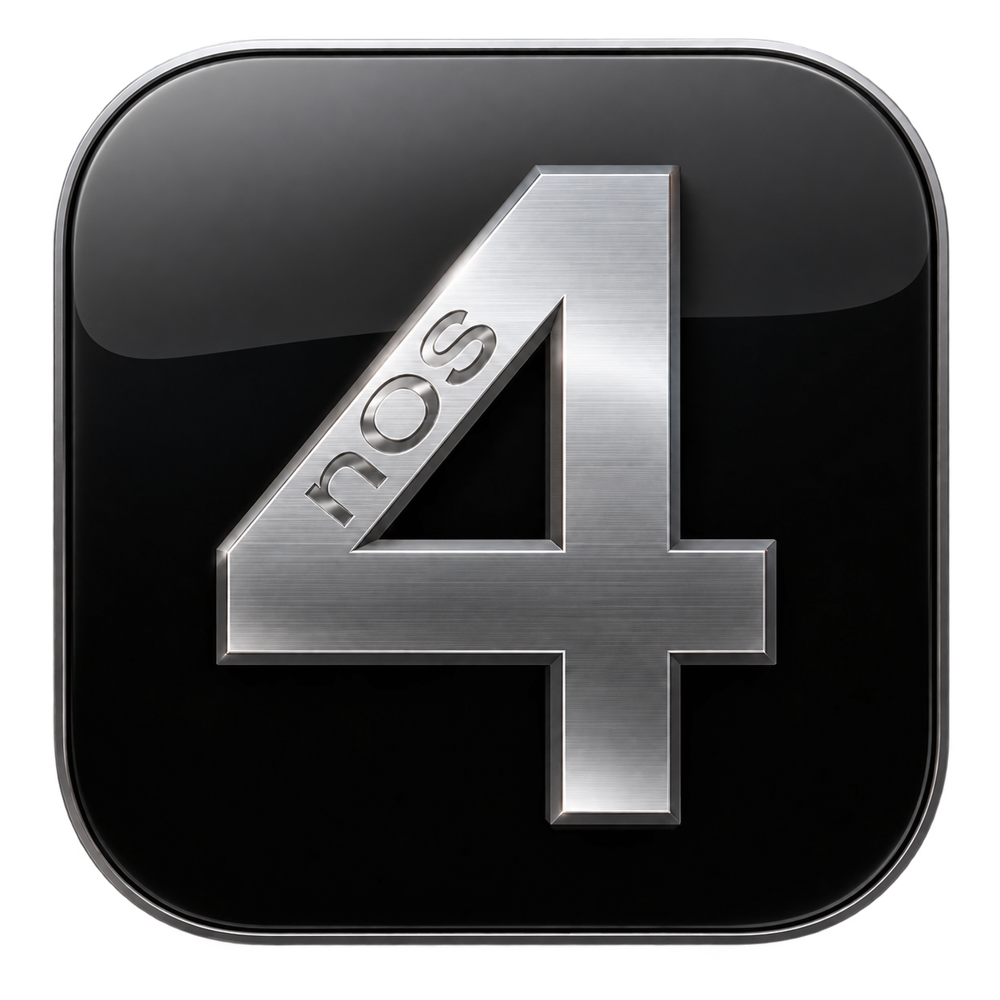

# nOS4

**Everything you remember. Right in your browser.**

[](https://www.typescriptlang.org)
[](https://www.solidjs.com)
[](https://vite.dev)
[](https://tailwindcss.com)
[](https://pnpm.io)

**[nos4.fun](https://nos4.fun)**

</div>

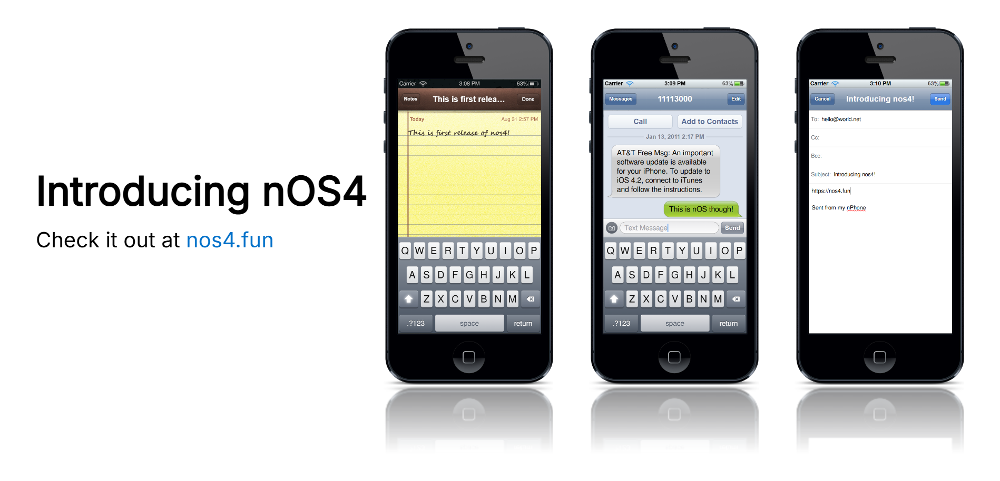

nOS4 is a recreation of iOS 4, running in the browser.

## Why

The best way to understand something is to rebuild it. So that's how nos4 born.

## What's inside

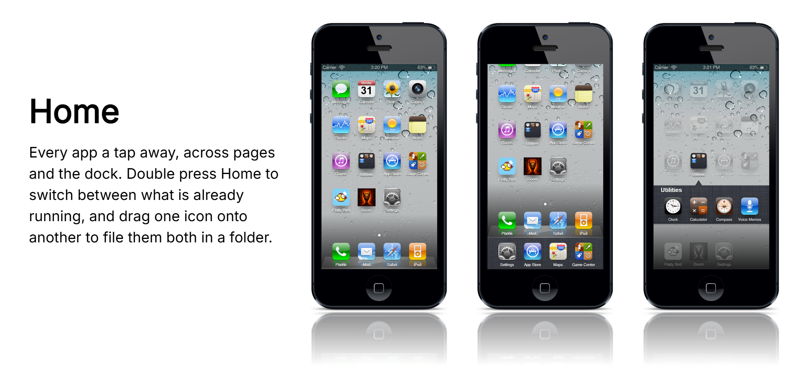

Twenty-three apps — Safari, Mail, Messages, Phone, Maps, iPod, Photos, Camera, Notes,
Weather, Stocks, Clock, Calculator, Compass, Voice Memos, Contacts, Settings, App Store,
iTunes, Game Center and two games.

Underneath sit sixteen frameworks:

| | |
|---|---|
| Foundation | the notification bus and primitives |
| CoreGraphics | asset manifest |
| CoreAnimation | timing curves and transitions |
| GraphicsServices | touch delivery and the scroller state machine |
| UIKit / TextInput | controls and the keyboard |
| SpringBoard | lock screen, pages, dock, folders, multitasking |
| SpriteKit / GameKit | the game runtime and leaderboards |
| AVFoundation, CoreLocation, CoreTelephony, SceneKit, … | the rest |

Nothing imports upward. `Foundation` → `CoreGraphics` → `UIKit` → `SpringBoard` → apps.

## The apps

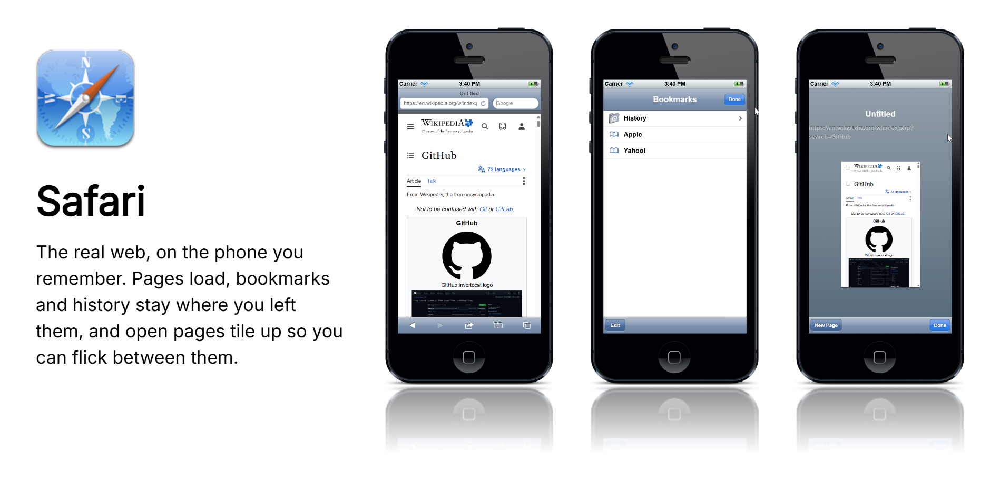

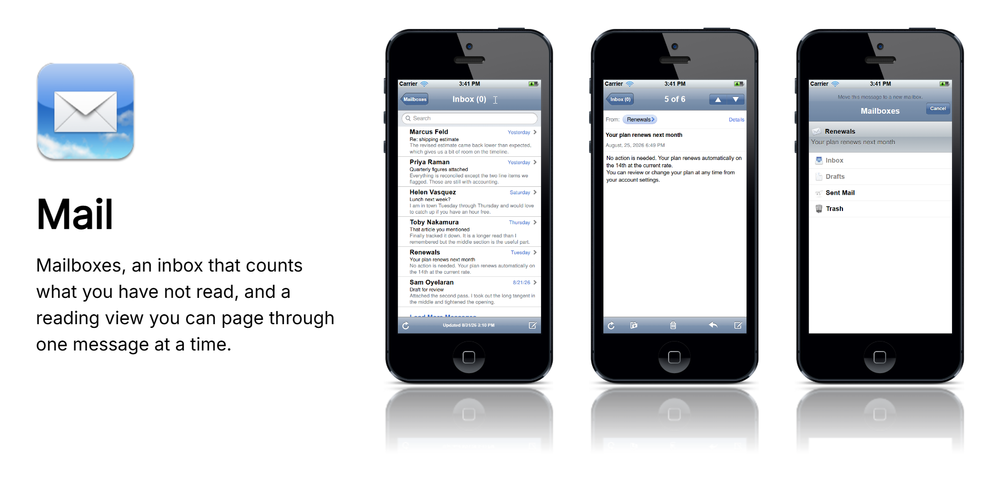

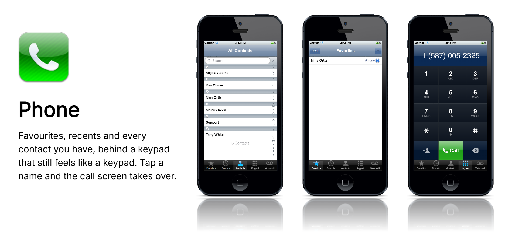

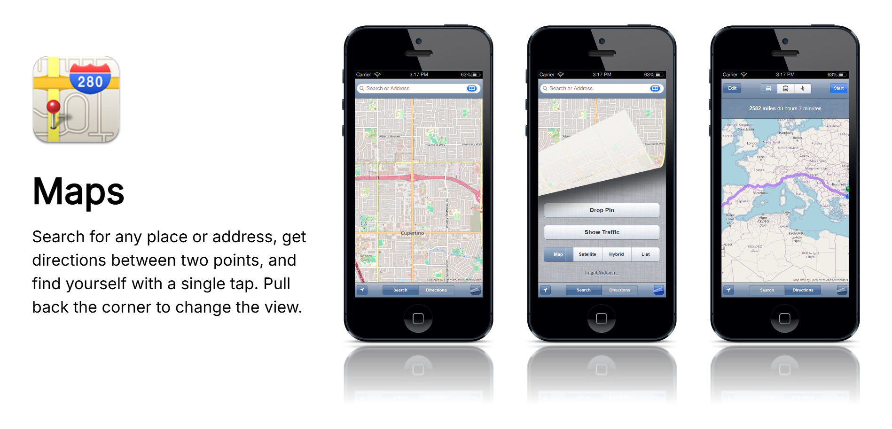

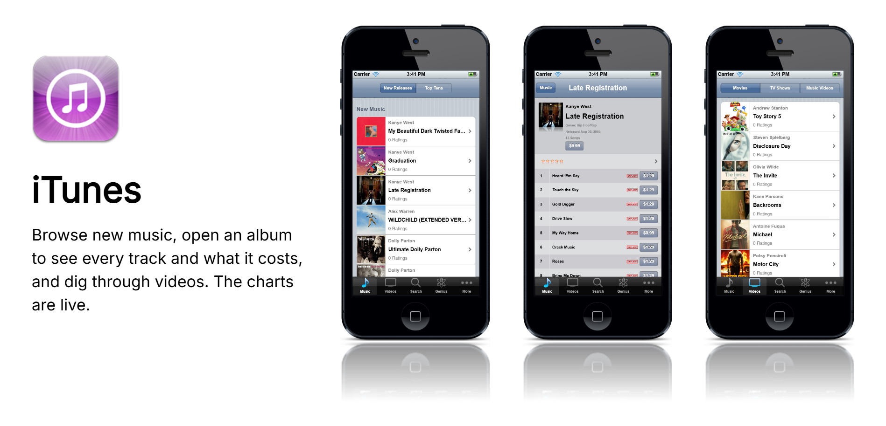

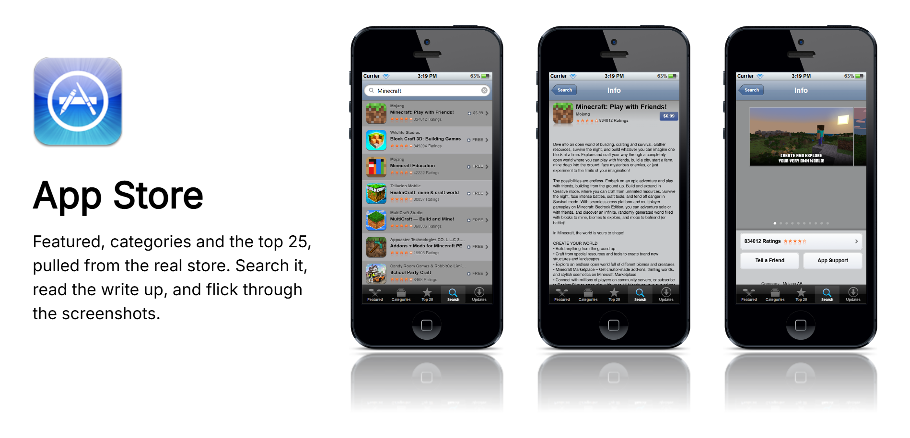

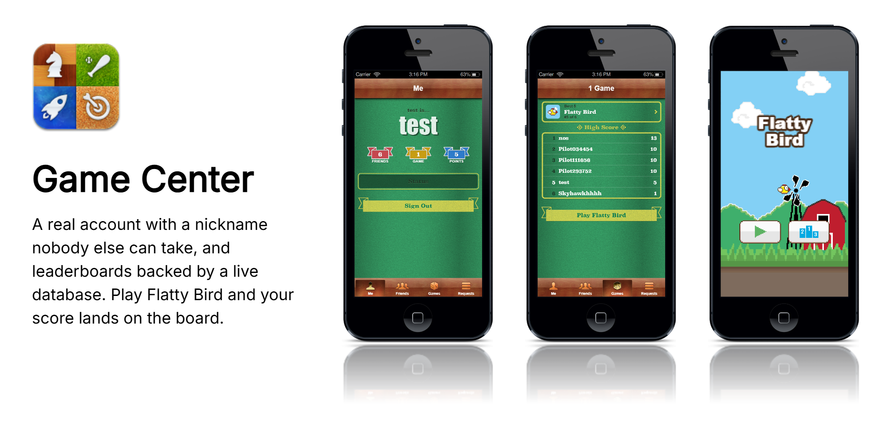

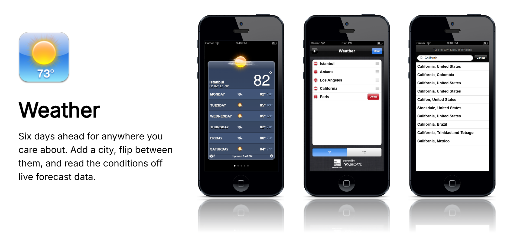

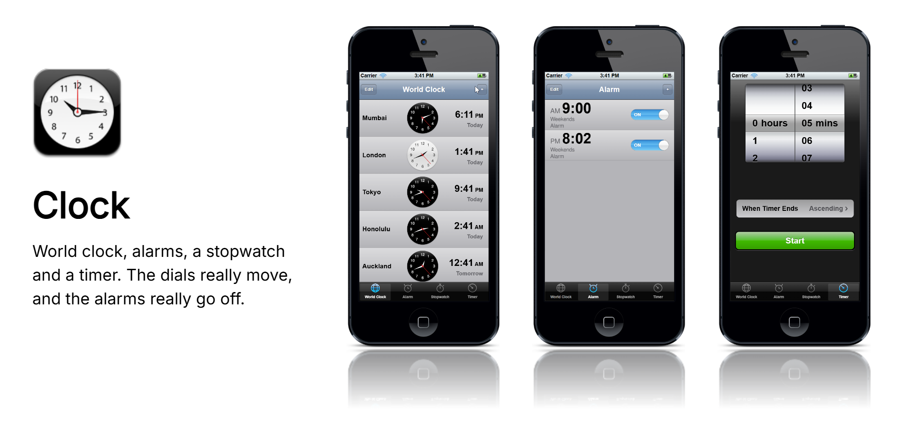

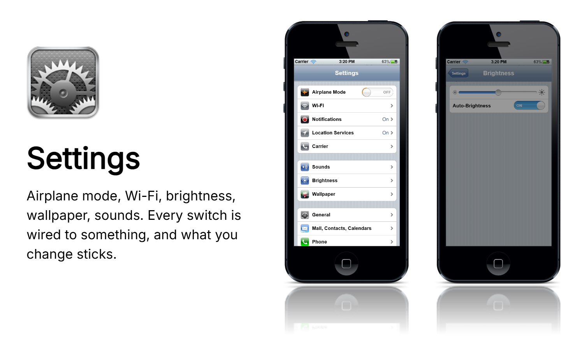

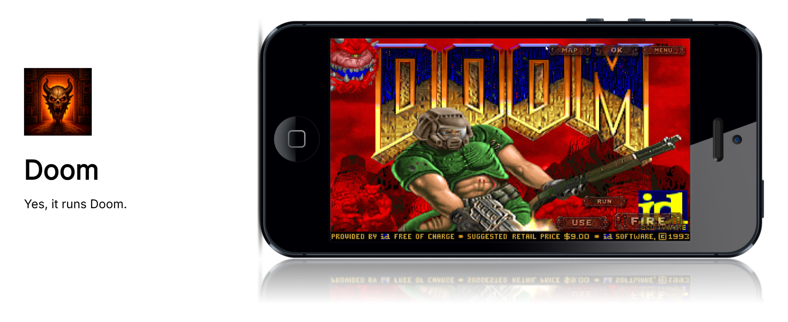

## 2010s Rich

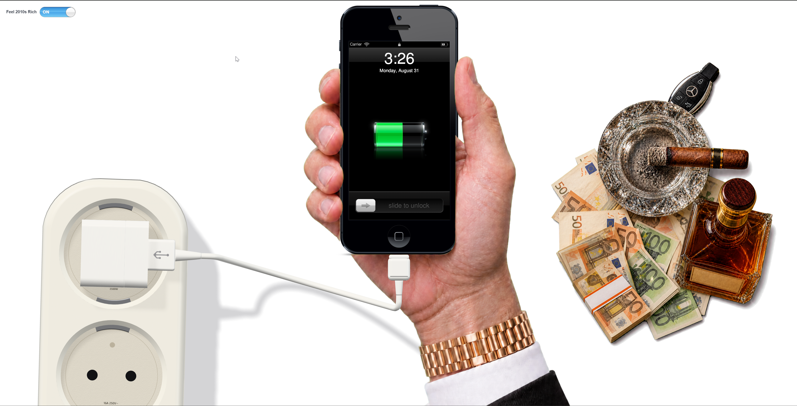

## Build

You need [Node 22.6+](https://nodejs.org) and [pnpm 10+](https://pnpm.io).

```sh
git clone https://github.com/1etu/nos4.git
cd nos4
pnpm install
```

Then run the phone:

```sh
pnpm -C apps/Phone dev
```

| Command | What it does |
|---|---|
| `pnpm -C apps/Phone dev` | the phone, on its own |
| `pnpm dev` | the debug page: event monitor beside the phone |
| `pnpm build` | production bundle into `apps/Phone/dist` |
| `pnpm typecheck` | the whole workspace, `strict` |
| `pnpm banner` | regenerate the marketing images above |

Game Center is the one part that needs a server. It is optional and everything else do work
without it. To run it, put a Postgres connection string in a root `.env`:

```sh
DATABASE_URL=postgresql://…
```

Apply `services/GameCenterService/schema/*.sql` in order, then `pnpm service`.

## Credits

**[The OldOS Project](https://github.com/zzanehip/The-OldOS-Project)** by
**[Zane (@zzanehip)](https://github.com/zzanehip)** — Its asset catalogue is
where nOS4's artwork comes from, nOS4 shares no code with it and every screen here was rewritten from scratch. Without it there would be nothing to measure.

Maps are drawn with [OpenStreetMap](https://www.openstreetmap.org/copyright) tiles, geocoded
by [Nominatim](https://nominatim.org) and routed by [OSRM](https://project-osrm.org).
Weather comes from [Open-Meteo](https://open-meteo.com). The App Store and iTunes read
Apple's public iTunes Search and RSS feeds. Type is set in
[Inter](https://rsms.me/inter/) and Helvetica Neue.

iPhone, iOS and the app designs recreated here are trademarks of Apple Inc. This is an
independent tribute, not affiliated with or endorsed by Apple.

